 

<h3 align="center"><em>"Architecting high-throughput enterprise systems, dynamic logistics engines, and real-time automation."</em></h3>

  
  
  

 

  <table border="0" style="border-collapse: collapse; border: none;">
    <tr>
      <td width="800" style="border: 1px solid #333; border-radius: 10px; background-color: #0d1117; padding: 20px;">
        <h3 align="left">🔴 🟡 🟢 &nbsp;&nbsp;&nbsp;&nbsp;&nbsp;&nbsp;&nbsp;&nbsp;&nbsp;&nbsp;&nbsp;&nbsp;&nbsp;&nbsp;&nbsp;&nbsp;&nbsp;&nbsp;&nbsp;&nbsp;&nbsp;&nbsp;&nbsp;&nbsp;&nbsp;&nbsp;&nbsp;&nbsp;&nbsp;&nbsp;&nbsp;&nbsp;&nbsp;&nbsp;&nbsp;&nbsp;&nbsp;&nbsp;&nbsp;&nbsp;&nbsp;&nbsp;mohit@macbook-pro: ~</h3>
        

        <pre style="background: transparent; border: none; font-family: 'Fira Code', monospace; color: #c9d1d9; text-align: left;">
mohit@macbook:~$ whoami
Mohit Lalwani
&nbsp;
mohit@macbook:~$ cat mission_statement.txt
"I architect resilient, high-availability logistics platforms and enterprise automation.
Currently engineering low-latency infrastructure that orchestrates live couriers and
dispatches thousands of encrypted WhatsApp notifications per second."
&nbsp;
mohit@macbook:~$ ls -l ./tech_stack/
drwxr-xr-x  <b>Frontend</b>    Vanilla JS, React 19, Next.js, Tailwind v4, Zustand, GSAP
drwxr-xr-x  <b>Backend</b>     Node.js, NestJS, PHP 8.2, Python, C#, ASP.NET Core
drwxr-xr-x  <b>Database</b>    PostgreSQL, MongoDB, Supabase, Redis, SQLite
drwxr-xr-x  <b>Dev_Tools</b>   Cursor, VS Code, IBM Bob, Docker, Postman, Termius, XAMPP
&nbsp;
mohit@macbook:~$ _ █
        </pre>
      </td>
    </tr>
  </table>

---

### 💻 Core Tech Stack & Private Repositories
*My primary engineering ecosystem spanning both open-source contributions and private enterprise architecture:*

  
  
  
  
  

  
  
  

  

---

### 🚀 Production Architectures

<table>
<tr>
<td width="50%" valign="top">

#### 🍬 Ramesh Sweets: Hyperlocal E-Commerce
**Enterprise E-Commerce & Dynamic Logistics Orchestrator**

An enterprise-grade, real-time checkout ecosystem integrated with live on-demand logistics (Uber, Borzo). Architected for extreme fault tolerance to seamlessly absorb massive traffic spikes during peak festival seasons with zero downtime.

▸ **Frontend:** React 19, Tailwind CSS v4, Zustand
▸ **Backend:** PHP 8.2 Microservices, Redis Cache
▸ **Integrations:** Uber Courier, Borzo, Rapido, Cashfree PG

</td>
<td width="50%" valign="top">

#### 💬 Bulk WhatsApp Engine
**High-Throughput Notification Dispatcher**

A highly scalable automation engine for transactional alerting and customer engagement. Engineered to bypass rate limits using sophisticated headless browser orchestration and DOM manipulation.

▸ **Core Engine:** Node.js, Express, Puppeteer
▸ **Features:** Configurable delay algorithms, custom parsers.
▸ **Dashboard:** Live audit tracking of delivery confirmations.

</td>
</tr>
</table>

---

---

### 📊 GitHub Diagnostics

  

  

  

