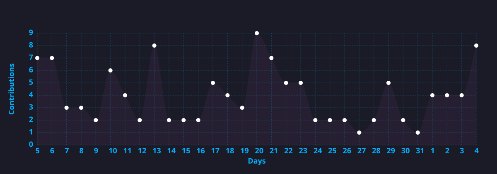

 

<h3 align="center"><em>"Architecting high-throughput enterprise systems, dynamic logistics engines, and real-time automation."</em></h3>

  
  
  

 

  <table width="100%" border="0" style="border-collapse: collapse; border: none;">
    <tr>
      <td style="border: 1px solid #333; border-radius: 10px; background-color: #0d1117; padding: 16px;">
        <table width="100%">
          <tr>
            <td align="left">🔴 🟡 🟢</td>
            <td align="right">mohit@macbook</td>
          </tr>
        </table>
        

        <pre style="background: transparent; border: none; font-family: monospace; color: #c9d1d9; text-align: left; white-space: pre-wrap;">mohit@macbook:~$ whoami
Mohit Lalwani

mohit@macbook:~$ cat mission_statement.txt
"I architect high-throughput enterprise systems and scalable workflows.
My mission is to engineer cost-effective, optimized software solutions
that radically simplify human effort and reduce operational overhead."

mohit@macbook:~$ ls ./tech_stack/
<b>Frontend</b>   Vanilla JS, React, Next.js, Tailwind, Zustand, GSAP
<b>Backend</b>    Node.js, NestJS, PHP, Python, C#, ASP.NET Core
<b>Database</b>   PostgreSQL, MongoDB, Supabase, Redis, SQLite
<b>Dev_Tools</b>  Cursor, VS Code, Docker, Postman, Termius

mohit@macbook:~$ █</pre>
      </td>
    </tr>
  </table>

---

### 💻 Core Tech Stack & Private Repositories
*My primary engineering ecosystem spanning both open-source contributions and private enterprise architecture:*

  
  
  
  
  

  
  
  

  

---

### 🚀 Production Architectures

<table width="100%">
<tr>
<td valign="top" style="padding: 16px; border: 1px solid #30363d; border-radius: 10px; background-color: #0d1117;">
<h3>🍬 Ramesh Sweets</h3>

<b>Hyperlocal E-Commerce · Dynamic Logistics</b>

An enterprise-grade, real-time checkout ecosystem integrated with live on-demand logistics (Uber, Borzo). Architected for extreme fault tolerance so peak festival traffic is absorbed with zero downtime.

<table width="100%">
<tr><td width="130"><b>Frontend</b></td><td>React 19, Tailwind CSS v4, Zustand</td></tr>
<tr><td><b>Backend</b></td><td>PHP 8.2 microservices, Redis</td></tr>
<tr><td><b>Integrations</b></td><td>Uber Courier, Borzo, Rapido, Cashfree</td></tr>
</table>
 

</td>
</tr>
<tr><td height="14"></td></tr>
<tr>
<td valign="top" style="padding: 16px; border: 1px solid #30363d; border-radius: 10px; background-color: #0d1117;">
<h3>💬 Bulk WhatsApp Engine</h3>

<b>High-Throughput Notification Dispatcher</b>

A scalable automation engine for transactional alerts and customer engagement, built to stay inside provider rate limits with headless browser orchestration and DOM control.

<table width="100%">
<tr><td width="130"><b>Core Engine</b></td><td>Node.js, Express, Puppeteer</td></tr>
<tr><td><b>Features</b></td><td>Configurable delays, custom parsers</td></tr>
<tr><td><b>Dashboard</b></td><td>Live audit of delivery confirmations</td></tr>
</table>
 

</td>
</tr>
</table>

---

### 📊 GitHub Diagnostics

  

  

  

